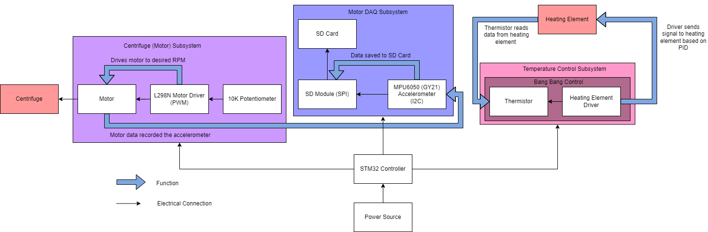

# WSST-CentrifugeRepo

This is a collection of firmware written for the Waterloo Space Soldering Team (WSST), a University of Waterloo design team, for its centrifuge. This project repository contains code for the motor control, data acquisition, and temperature control subsystems that were created as part of the CANRGX7 submission on behalf of WSST.

- **/Arduino Code**
  - This folder contains a variety of Arduino code sketches that were created during the prototyping stage of the project. The folder, labelled "WORKS--Tested-MOTOR-DAC-SYSTEM", uses the L298N motor driver, a 24V gear motor, the MPU6050 accelerometer, an SD Module as well as an Arduino, to track and save acceleration and gyroscopic data while driving the motor. It uses protocols like I2C (accelerometer), SPI (SD module), and PWM (drives the motor) to run.
- **/STM32 Code**
  - This folder, contains an STM32 project, still under progress for the working iteration of the project (i.e, most current). Along with performing the same functionality as the Arduino prototype code (of running the motor using the driver, and collecting and saving data from the accelerometer to the SD card), it also facilitates Bang-Bang Control using a thermistor to control heat being applied to the soldering samples on board the centrifuge, along with an IR sensor used to get data for the motor's rotational output.

#### Software Architecture

#### Construction Check - 2024/3/8
* Code for prototype centrifuge is under Arduino Code/WORKS--Tested-MOTOR-DAC-SYSTEM/WORKS--Tested-MOTOR-DAC-SYSTEM.ino
* Please ensure all relevant libraries are downloaded. This should include libraries for SPI, I2C, the SD library, and the MPU6050_tockn library. All of these are in the library folder as well
